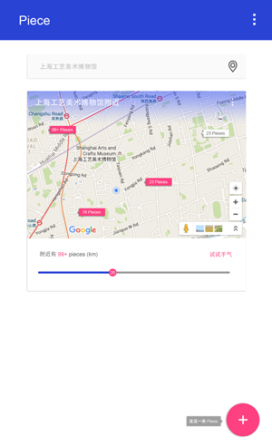

# Piece

studyJams 的第二阶段项目

## 项目介绍

基于地理位置的信息发布APP，用户可以写纸条发布到现在的地理位置，只有处在相同地理位置的用户才能有机会看到纸条的内容。

**距离远近分为：**

- c: 同城
- n: 附近
- s: 同地

**根据需要调整**

**根据纸条的类型，默认查看的最大距离权限：**

- 交友信息[n]
- 匿名发布小纸条[s]
- 新闻[c]
- 商业促销[n]
- 活动[c]
- 讲故事[s]
- 短视频[s]
- 等等其他[c]

## 这是一个地图应用

使用[Google Map API](https://developers.google.com/maps/)

PS设计图：

## 目前阶段

组队中...

**截至时间：2016-6-30 23:59:59**
